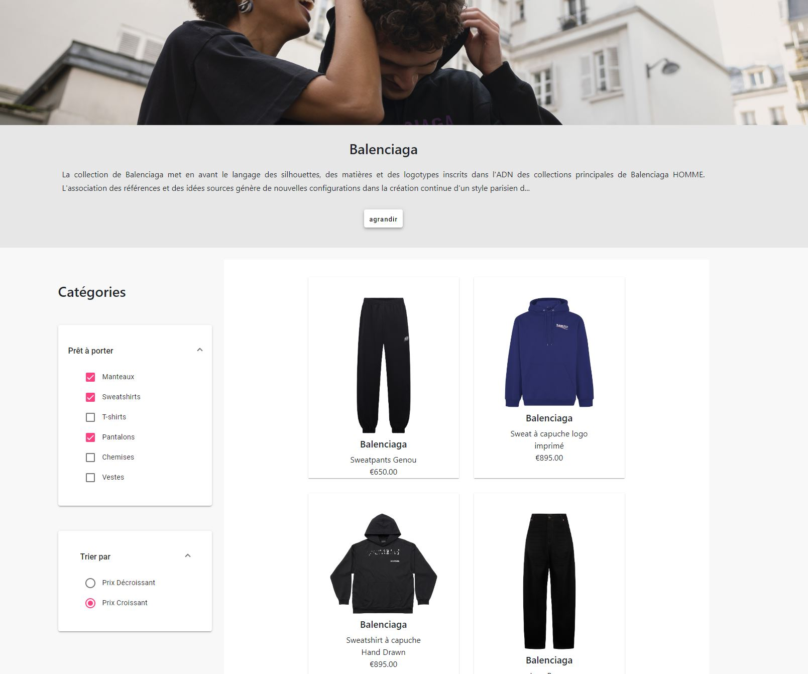
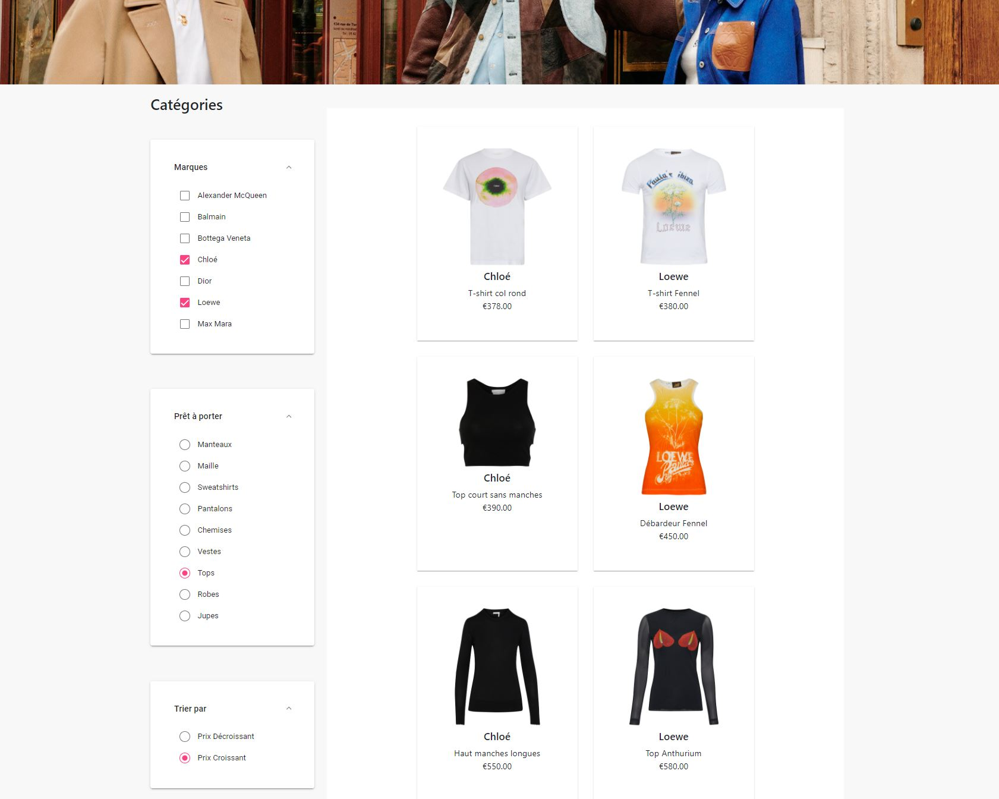
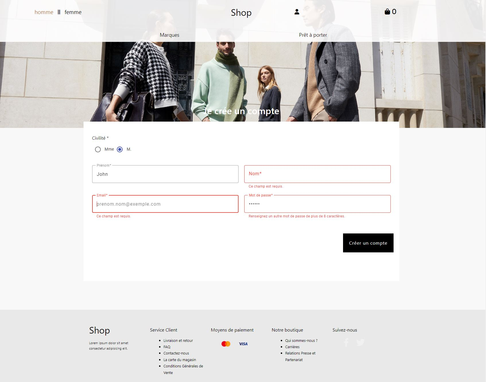
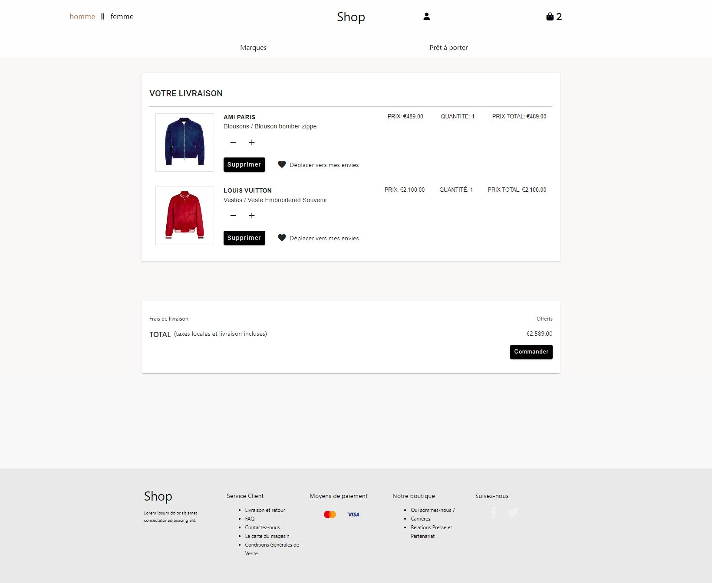
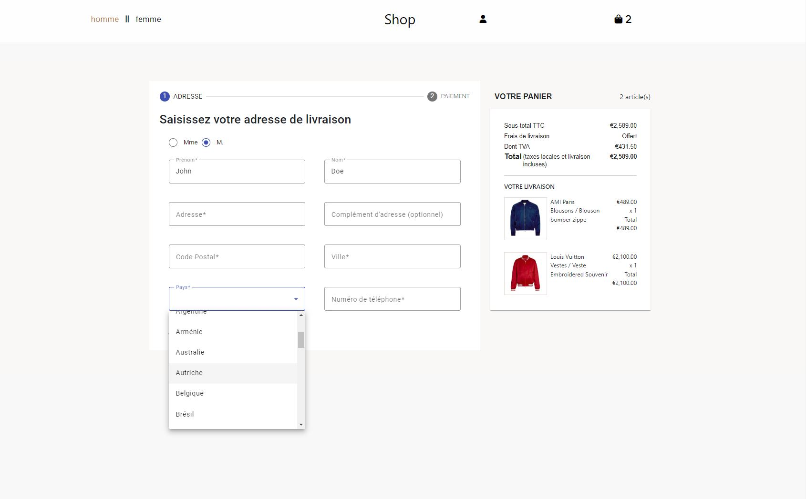
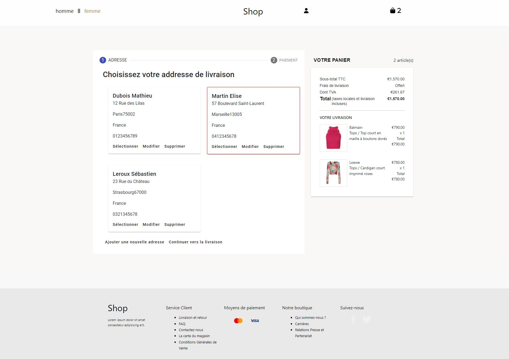
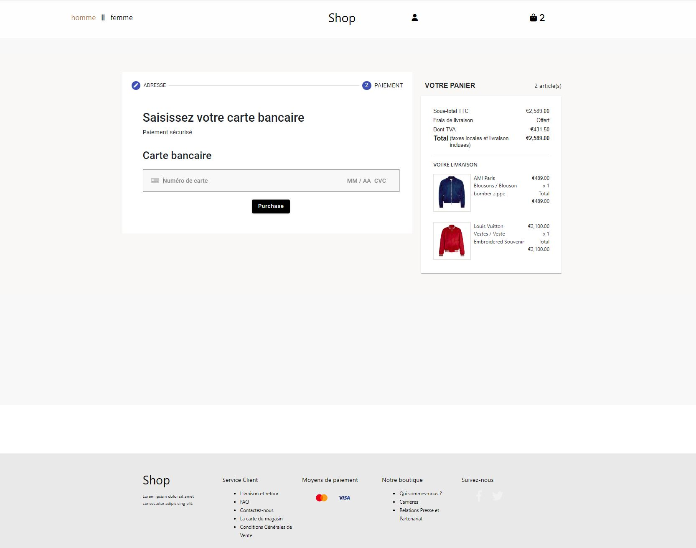
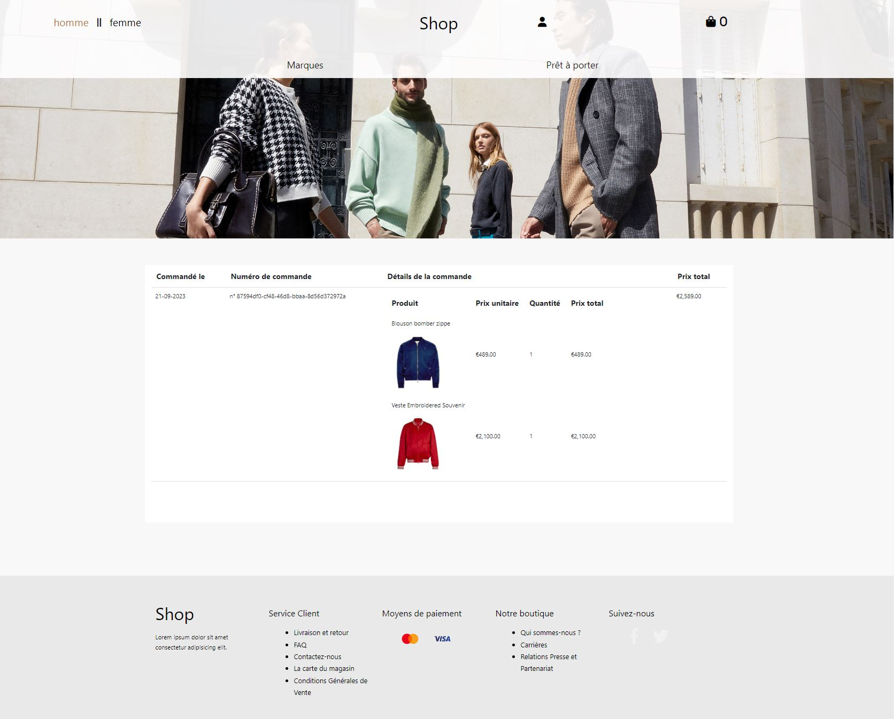

# spring-boot-ecommerce-app

E-commerce project developed using Spring Boot and Angular<br>

## Used Technologies:

- **Back-end**: Java 17, Spring Boot(v3.1.0), Spring MVC, Spring Data JPA/Hibernate, Security, Lombok, Mapstruct, Maven, JUnit, Mockito
- **DBMS**: PostgreSQL
- **Front-end**: Typescript, Angular 15, RxJs, NgRx, Angular Material
- **Security**: Spring Security, JWT
- **Stripe:** Payment service API to handle user payment requests.
- **AWS S3**
- **API Doc**: Swagger (springdoc-openapi)
- **Docker-Compose:** Easy way to bring up the application using containerization and behaves similarly in the production environment.

## Features

- Authentication with JWT
- JWT information are stored in localStorage.
- Customer Information are stored in the database.
- Customer can search for the product according to specified criteria (gender, brands, apparel categories)
- Customer can sort products by price
- Pagination is used to display products for better efficiency and reduce the load on the server
- Customer can add products to the shopping cart
- Customer can add and delete product from the shopping cart
- Customer can add, edit and delete shipping address when ordering their shopping cart
- Customer can order the products in the shopping cart with a fake card number (using Stripe's API)
- Some information like cart details are stored in localStorage to persist on page refresh.
- Customer can view their orders
- Responsive design for all devices.

## Prerequisites

In order to run this project, you'll need to have the following installed:

- [Docker](https://www.docker.com/products/docker-desktop)
- [Docker Compose](https://docs.docker.com/compose/install/)

## Running the Project with Docker Compose

1. **Clone the Repository**

   ```bash
   git clone https://github.com/cthet/spring-boot-angular-ecommerce-app.git
   ```

2. **Build and Launch the Containers**

   Use Docker Compose to build and launch the containers:

   ```bash
   docker-compose up --build
   ```

   The `--build` option is used to build the images before starting the containers. If you've already built the images, you can simply use `docker-compose up`

## Swagger documentation

local: http://localhost:8080/swagger-ui/index.html

## Screenshots

|        Menu Page: Brands list for Women        |                      Menu Page: Ready-to-wear (apparel categories) list for Men                       |
| :--------------------------------------------: | :---------------------------------------------------------------------------------------------------: |
| |  |

| Women Brand Page: List of Apparels | Women Ready-to-wear page: List of Apparels |
| :--------------------------------: | :----------------------------------------: |
|            |                    |

| Authentication Page: Sign-in | Authentication Page: Sign-up |
| :--------------------------: | :--------------------------: |
|      |      |

|    Shopping Cart Page    | Order Page: Adding Address |
| :----------------------: | :------------------------: |
|  |    |

| Order Page: Selecting Address | Order Page: Adding Card Number |
| :---------------------------: | :----------------------------: |
|       |        |

|       Profile Page        |   Customer orders list    |
| :-----------------------: | :-----------------------: |
|  |  |
